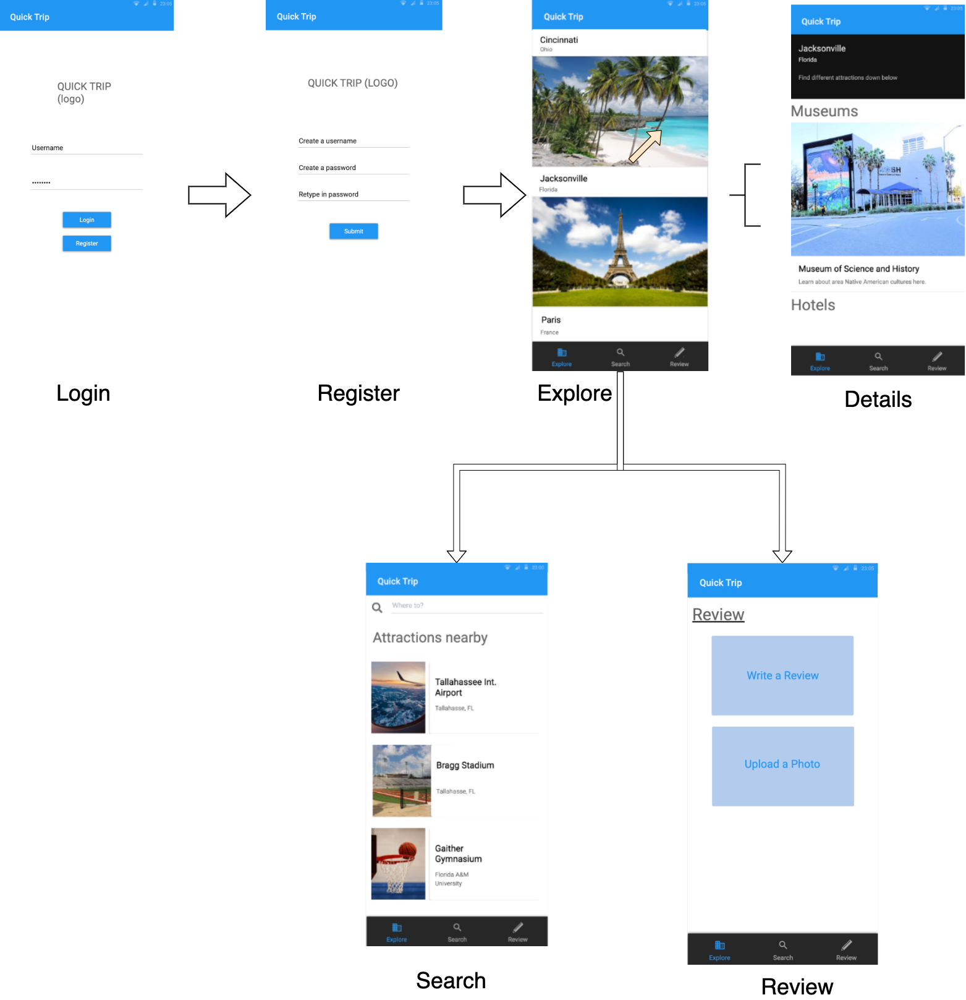
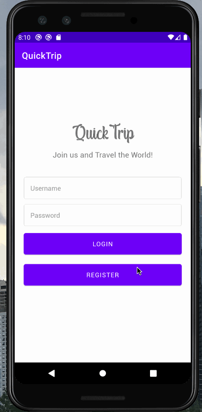

# QuickTrip

## Table of Contents
1. [Overview](#Overview)
1. [Product Spec](#Product-Spec)
1. [Wireframes](#Wireframes)
2. [Schema](#Schema)

## Overview
### Description
A mobile travel app that assists customers in gathering travel information, posting reviews and opinions of travel-related content.

### App Evaluation
[Evaluation of your app across the following attributes]
- **Category: Travel Guide App**
- **Mobile: The app is relevant to being mobile because it gives users convient access in searching travel information as well as posting their personal experiences.**
- **Story: The value of this app will be very useful once completed as it allows users access to traveling information in a convient and user friendly way.**
- **Market:The market for a travel app is large, as people are looking to travel and vacation year round.**
- **Habit: An average person would use this app atleast once a week, as we offer intriguing deals based on their preferences.**
- **Scope: The industry for this app is well informed. A stripped down version of the app will still be interested to build, although a completed version will be technically capabile as well**

## Product Spec

### 1. User Stories (Required and Optional)

**Required Must-have Stories**

* User can save a location to their account
* User can create a new account
* User can login
* User can search for other locations
* User can see trending locations

**Optional Nice-to-have Stories**

* User can add a review to a location
* User can tap a location to view a more detailed photo screen with reviews
* User can see their profile page with a list of the locations saved

### 2. Screen Archetypes

* Login Screen
    * User can login
* Registration Screen
    * User can create a new account
* Explore
    * User can view a feed of various destinations
    * User can tap on a locations to view more information
* Review
    * User can post a review to locations visited
    * User can upload a photo to locations visited
* Search
    * User can search for locations
    * User can save locations

### 3. Navigation

**Tab Navigation** (Tab to Screen)

* Explore
* Search
* Review

**Flow Navigation** (Screen to Screen)

* Login Screen
    => Explore
    => Registration
* Registration Screen
    => Explore
    => Login
* Explore Screen
    => Navigation to a detailed screen to see attractions for different locations.
* Search Screen
    => Navigation to a detailed screen to see attractions for different locations.
* Review Screen
    => Navigation to the location/attraction previously searched (after you finish posting the review)

## Wireframes

### [BONUS] Digital Wireframes & Mockups

### [BONUS] Interactive Prototype

## Schema 
### Models
Review
| Property | Type   | Description |
| -------- | ------ | ----------- |
| reviewId | String | unique id for the review post (default field) |
| author   | Pointer to User | image author |
| image    | File   | image that user posts|
| description | String | image description by author |
| commentsCount | Number | number of comments that has been posted to an image |
| Rating   | String | User rating for the review post |
| createdAt| DateTime | date when post is created (default field) |

User
| Property | Type | Description |
| -------- | ---- | ----------- |
| userId   | String | unique id for the user post (default field)|
| firstName| String | First name for user |
| lastName | String | Last name for user |
| profilePhoto | Image | Image for the user |
| dateCreated     | DateTime | Date when the user account was created |

### Networking
| CRUD     | HTTP Verb| Example  |
| -------- | -------- | -------- |
| Create   | POST     | Create a new review     |
| Read     | GET     | Fetching review for a user's feed    |
| Update   | PUT     | Changing a user's profile image     |
| Delete   | DELETE     | Deleting a post     |

Review Feed Screen
* (Read/GET) Query all posts where user is author under existing location
* (Create/POST) Create a new review on a location
* (Delete) Delete existing post

Create Post Screen
* (Create/POST) Create a new post object

Profile Screen
* (Read/GET) Query logged in user object
* (Update/PUT) Update user profile image
- [Create basic snippets for each Parse network request]
- [OPTIONAL: List endpoints if using existing API such as Yelp]
 
 ## Sprint 1 Recap
 
 ### Sprint 1 Gif
 
 
 ## User Stories

The following functionality is completed:

- [x] User can log in account using Parse.
- [x] The current signed in user is persisted across app restarts.
- [x] Parse has been configured
- [x] Database has been created using back4app

## Sprint 2 Recap

## Sprint 2 Gif
 
 
 ## User Stories

The following functionality is completed:

- [x] User can register an account with Parse implementation
- [x] User can review explore screen
- [x] User can be directed to the details screen
- [x] Within the details the user can review more information

## Sprint 3/4 Recap

## Sprint 3/4 Gif
 
 
 ## User Stories

The following functionality is completed:

- [x] User can navigate to the review screen through the details screen 

 
